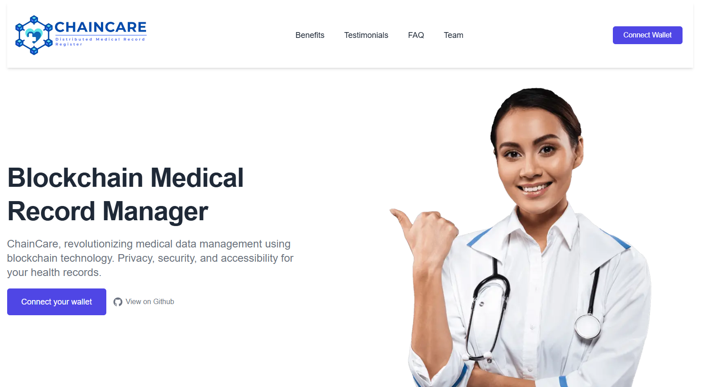
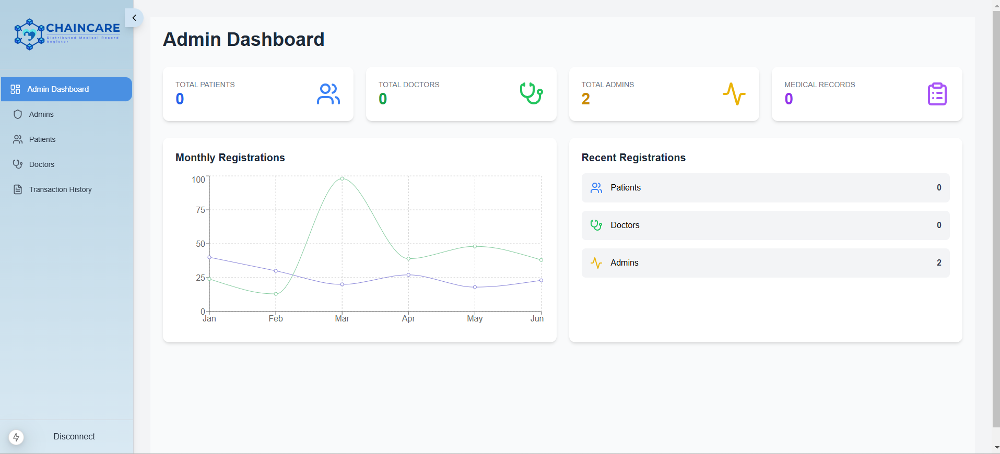
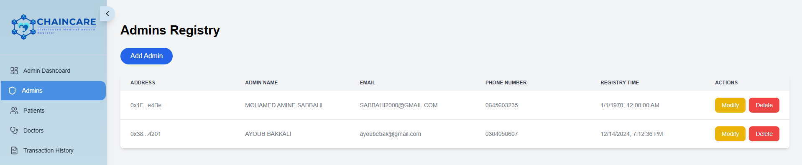
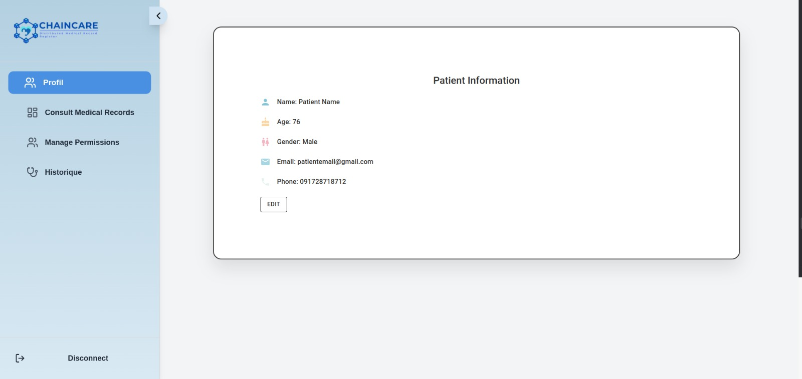
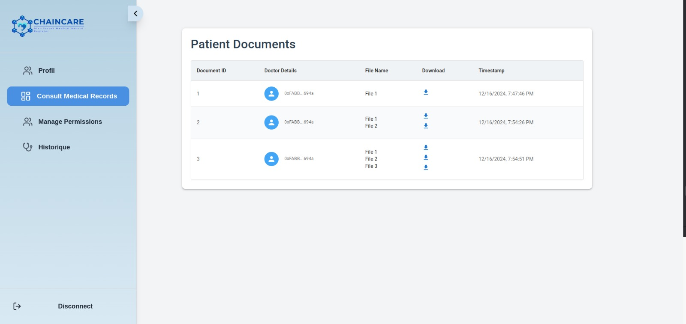
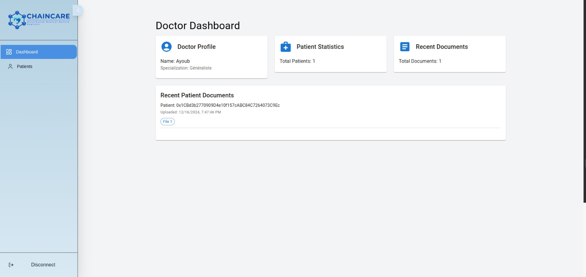
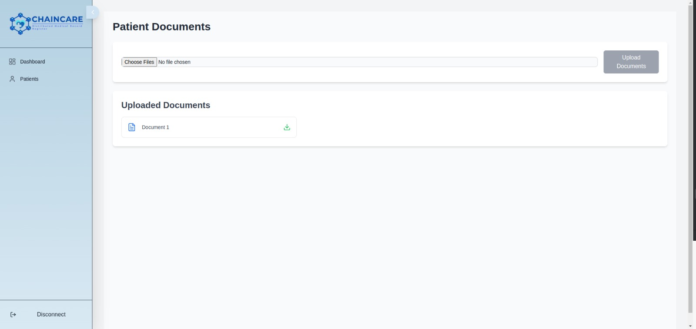

# ChainCare Web3 Medical Records DApp

## Overview

ChainCare is a decentralized application (DApp) for managing medical records using blockchain technology. This project leverages Ethereum smart contracts and decentralized storage (IPFS) to ensure security, transparency, and immutability in the management of sensitive medical data. It provides tailored interfaces for administrators, patients, and doctors to interact with the system securely and efficiently.



## Key Features

### Administrator
- Manage user accounts (patients, doctors, admins).
- View system statistics (transactions, active users, stored documents).
- Supervise and audit blockchain transactions.





### Patient
- Access personal medical records.
- Upload new medical files to IPFS.
- Grant or revoke access to doctors.
- View transaction history (e.g., doctor file access).





### Doctor
- View authorized patient data.
- Add medical documents for patients securely.
- Access medical records through blockchain and IPFS.




## Technology Stack

### Frontend
- **Next.js**: Provides a responsive and user-friendly interface.

### Backend/Smart Contracts
- **Solidity**: Smart contract development.
- **Remix IDE**: Development and deployment of Ethereum smart contracts.
- **Ganache**: Local Ethereum blockchain simulation for testing.

### Blockchain & Storage
- **Ethereum Sepolia Testnet**: Deployment and testing of smart contracts.
- **IPFS (InterPlanetary File System)**: Decentralized storage of medical files.

### Tools
- **MetaMask**: User authentication and transaction signing.

## Architecture

1. **User Interaction**: Users connect their MetaMask wallets to interact with the DApp.
2. **Smart Contracts**: Control access and record all interactions immutably on the blockchain.
3. **IPFS Storage**: Medical files are stored securely on IPFS, with file hashes referenced in the blockchain.
4. **Front-End Interface**: Dynamic dashboards for admins, patients, and doctors.

## Installation

```bash
# Clone the repository
git clone https://github.com/amine-sabbahi/ChainCare-Web3-MedicalRecords-Dapp.git

# Navigate to the project folder
cd ChainCare-Web3-MedicalRecords-Dapp/chaincare

# Install dependencies
npm install

# Run the development server
npm run dev
```

## Usage

1. Connect your MetaMask wallet.
2. Select your role (Administrator, Patient, or Doctor) to access the relevant dashboard.
3. Perform actions such as uploading documents, managing user permissions, or auditing transactions based on your role.

## Contributors


   - [BAKKALI AYOUB](https://github.com/BAKKALIAYOUB).

   - [NIDAR SALMA](https://github.com/salma31nidar).

   - [SABBAHI MOHAMED AMINE](https://github.com/amine-sabbahi).

---

**Abdelmalek Essaadi University** Faculty of Sciences and Techniques
   - Department : Computer Engineering
   - Master : AI & DS
   - Module : Blockchain
   - Framed by : Pr. Ikram Ben abdel ouahab
